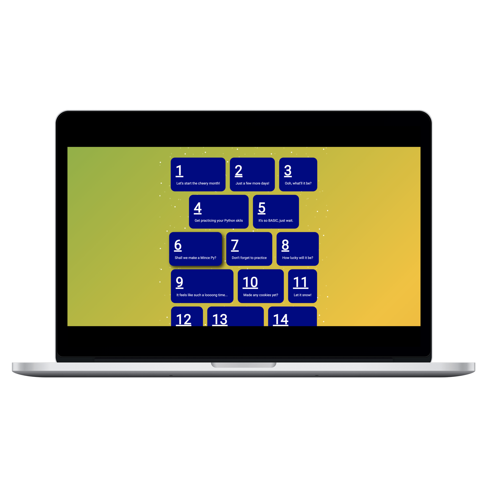

# Python Advent Calendar

As I write this, December is rapidly approaching(Oh, it's actually tomorrow!). How many of you are thinking about buying, or have already bought, an advent calendar? Probably quite a few. This is an advent calendar for Python users!

Each day will be unlocked at 6AM UTC/GMT via a Python backend. Due to this being automatic, the GitHub repository will remain private until after Christmas.

Sadly, I've had to rush this project as I only though of it on Sunday night, but I'm really happy with how it turned out. I might make a few changes, but this should be ready for use!

Each day, you'll gain access to a new challenge. This is meant to be completed in Python, but I'm sure the majority of them can be done in other languages.

On the challenge page, you'll see a description of the challenge, and a Login with Replit button. This will then allow you to submit your solution. After Christmas, I'll create a portfolio/gallery of the different solutions, so be unique!

Happy Coding!
DillonB07
